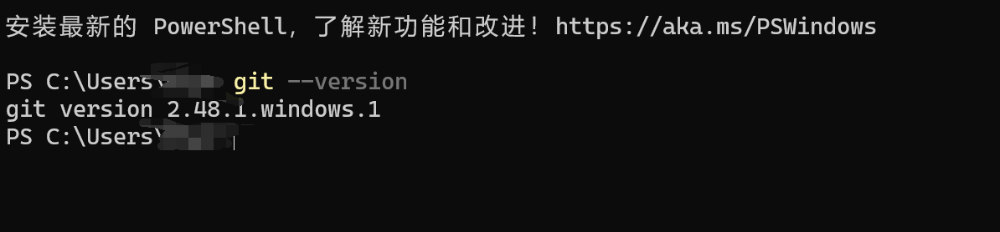
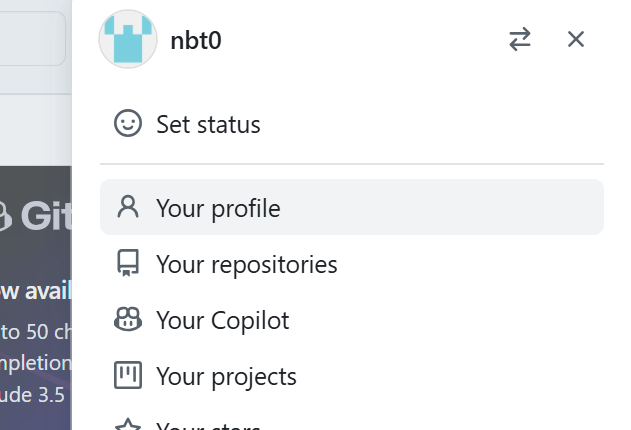
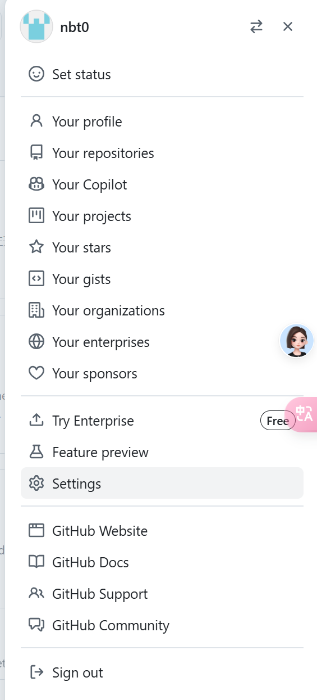
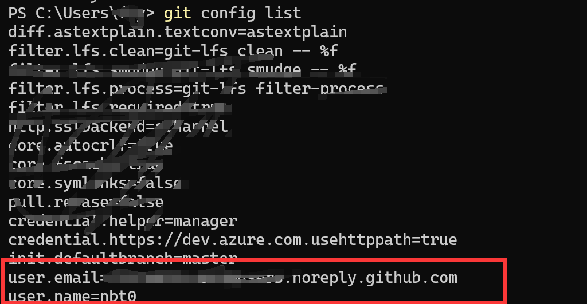
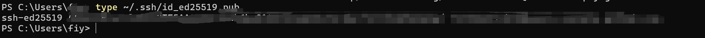
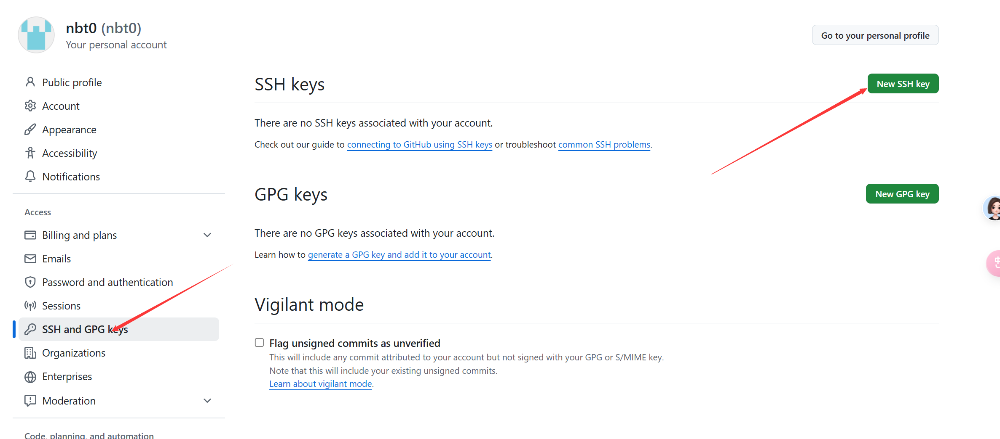
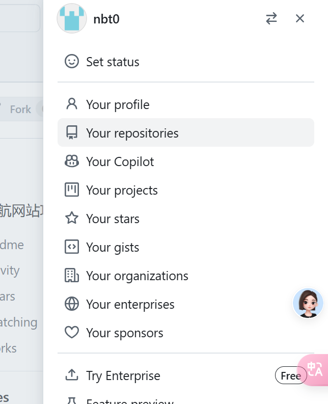
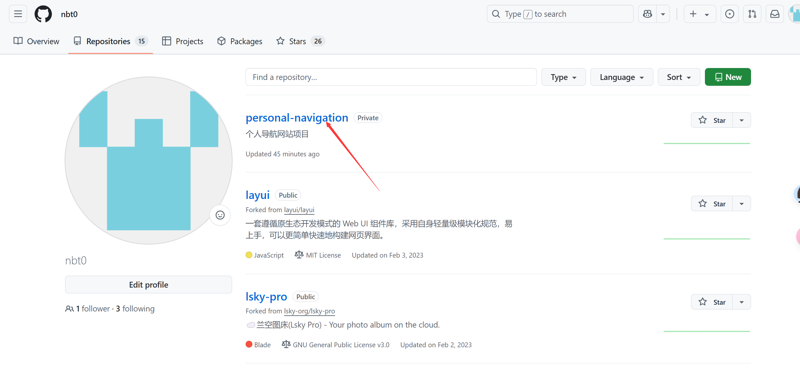
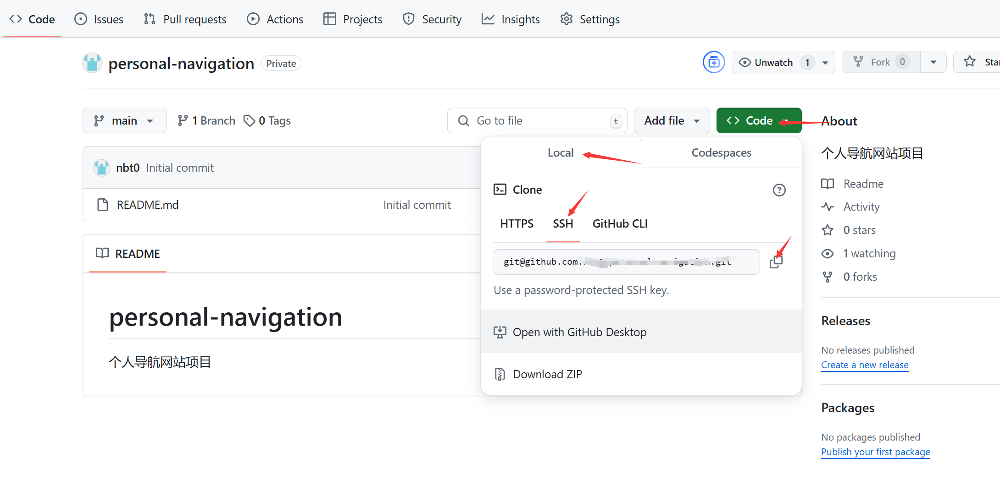
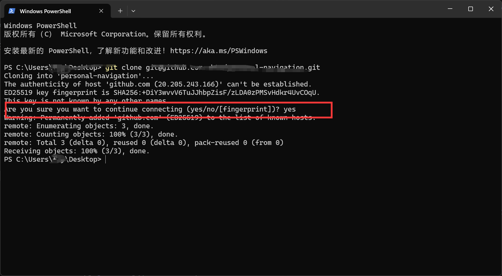

# Personal Navigation Site

这是一个基于 GitHub Pages 和 GitHub Issues 的个人导航网站项目。

## 🎉 1.0 版本发布！

### 主要功能
- ✨ GitHub Token 快捷登录
- 📝 基于 Issues 的网站管理
- 🖼️ 自动获取网站图标
- 📱 响应式布局设计
- 🚀 一键部署到 GitHub Pages

### 在线体验
访问示例站点：https://nbt0.github.io/personal-navigation/

## 项目说明
这个项目有两个目标：
1. 开发一个基于 GitHub Issues 的个人导航网站
2. 后续会通过这个项目编写一份 Cursor + AI 辅助开发的教程

## 特性

- 🔒 使用 GitHub Token 进行身份验证
- 📝 使用 Issues 存储网站数据
- 🖼️ 自动获取网站图标
- 📱 响应式布局，支持移动端
- 🚀 纯静态部署，无需后端服务

## 快速开始

1. **Fork 本仓库**

2. **开启 GitHub Pages**
   - 进入仓库设置 -> Pages
   - Source 选择 "GitHub Actions"

3. **访问你的网站**
   - 地址：`https://你的用户名.github.io/personal-navigation/`
   - 点击右上角"登录"按钮
   - 在弹窗中点击"前往 GitHub 创建 Token"
   - 生成并保存 Token
   - 开始添加你的网站收藏

## 技术栈

- ⚛️ React + Vite
- 🎨 Ant Design
- 📦 GitHub REST API
- 🚀 GitHub Actions

## 更新日志

### v1.0.0 (2024-03-21)
- ✨ 完成基础功能开发
- 🎨 优化用户界面和交互
- 🐛 修复已知问题
- 📝 完善项目文档

## 本地开发

```bash
# 克隆仓库
git clone https://github.com/你的用户名/personal-navigation.git

# 安装依赖
npm install

# 启动开发服务器
npm run dev

# 构建
npm run build
```

## 如何使用

### 1. 数据管理
在 GitHub Issues 中管理网站数据：
1. 创建新的 Issue
2. 添加 `website` 标签
3. Issue 标题作为网站名称
4. Issue 内容使用 JSON 格式：
```json
{
  "url": "https://github.com",
  "description": "全球最大的代码托管平台",
  "icon": "https://github.com/favicon.ico"
}
```

### 2. 部署
1. 在 GitHub Pages 设置中启用 Pages 功能
2. 选择 main 分支作为源
3. 网站将自动部署

### 3. 更新网站
- 添加网站：创建新的 Issue
- 编辑网站：编辑对应的 Issue
- 删除网站：关闭对应的 Issue

## 开发日志

### 2024-03-21 - 项目初始化
- [x] 创建私有仓库
- [x] 初始化 README.md
- [x] Git 环境配置（详细步骤见下方）
- [x] 开发环境准备
  - [x] 检查并安装 Node.js
  ```bash
  # 检查 Node.js 版本
  node --version
  npm --version

  # 如果没有安装，使用 winget 安装
  winget install OpenJS.NodeJS

  # 如果 npm --version 报错，以管理员身份运行：
  Set-ExecutionPolicy RemoteSigned
  ```
- [x] 技术方案确定
  - [x] 选择前端框架：React + Vite
  - [x] 选择 UI 框架：Ant Design
  - [x] 项目初始化
    ```bash
    # 备份 README 和图片
    mkdir temp_backup
    mv README.md temp_backup/
    mv image*.png temp_backup/

    # 初始化 Vite 项目
    npm create vite@latest . -- --template react
    npm install

    # 安装依赖
    npm install antd @ant-design/icons        # UI 组件库
    npm install react-router-dom              # 路由
    npm install -D tailwindcss postcss autoprefixer  # 样式工具

    # 恢复备份文件
    mv temp_backup/* .
    rm -r temp_backup
    ```

### Git 环境配置步骤
1. 安装 Git
首先确认是否安装了 Git，打开终端/命令行：
如果没有安装，需要先去 https://git-scm.com/downloads 下载安装
也可以直接在 PowerShell 输入`winget install --id Git.Git -e --source winget`



关闭当前 PowerShell 打开一个新的验证是否安装成功`git --version`，如果还不行建议搜索`手动添加 Git 到系统环境变量`

2. 查看自己的github用户名 邮箱：



进入个人主页，URL 中的就是用户名`https://github.com/your-username`
点头像，`Settings`进入设置



进入设置点`E-mail`红框框出来的位置就是GitHub 提供的 noreply 邮箱
3. 配置用户信息
```bash
git config --global user.name "你的GitHub用户名,双引号要带上"
git config --global user.email "你的GitHub邮箱"
git config list
```
成功后显示如下配置 



3. 生成 SSH key：
```bash
   ssh-keygen -t ed25519 -C "你的GitHub邮箱" #可以设置密码，也可以直接回车不设置
   type ~/.ssh/id_ed25519.pub
```
然后手动复制输出的内容



4. 添加 SSH key 到 GitHub
访问 https://github.com/settings/keys，点击 "New SSH key"



Title 随便填（比如："我的个人电脑"）
Key 粘贴刚才复制的输出内容
点击 "Add SSH key"
5. 克隆仓库：
github前往个人仓库进行克隆准备




如下图点击



在本地电脑选择一个合适的目录，打开终端：
```bash
# 如果不知道如何选择一个目录打开终端 建议先去百度or问ai
# 克隆仓库
git clone 刚刚点击复制的
# 进入项目目录
cd 项目文件夹名字
```
如果clone遇到下图的安全提示 yes即可



6. 验证连接
```bash
我们可以更新 README.md 来测试：
# 查看当前状态
git status
# 文本文档打开README.md进行修改 添加更改
git add README.md
# 提交更改
git commit -m "更新 README.md"
# 推送到 GitHub
git push
```

### 2024-03-21 - 项目结构搭建
- [x] 规划项目目录结构
- [x] 创建基础目录结构
  ```bash
  # 创建目录结构（Windows PowerShell）
  mkdir -p src/components/Layout
  mkdir -p src/components/WebsiteCard
  mkdir -p src/components/AddEditForm
  mkdir -p src/pages/Home
  mkdir -p src/pages/Management
  mkdir -p src/services
  mkdir -p src/utils
  mkdir -p src/hooks
  mkdir -p src/styles

  # 创建基础文件（Windows PowerShell）
  New-Item -ItemType File -Path src/services/github.js
  New-Item -ItemType File -Path src/services/auth.js
  New-Item -ItemType File -Path src/utils/request.js
  New-Item -ItemType File -Path src/utils/storage.js
  New-Item -ItemType File -Path src/hooks/useGitHub.js
  New-Item -ItemType File -Path src/styles/global.css
  ```
- [x] 设计并实现布局组件
  - 创建 Layout 组件，包含：
    - 顶部导航栏
    - 主要内容区域
    - 页脚
  - 安装依赖：
    ```bash
    npm install react-router-dom @ant-design/icons
    ```
- [x] 设计并实现网站卡片组件
  - 创建 WebsiteCard 组件，包含：
    - 网站图标展示
    - 标题和描述信息
    - 访问、编辑、删除按钮
  - 样式配置：
    ```bash
    # 配置 Tailwind CSS
    npx tailwindcss init -p
    
    # 引入 Ant Design 样式
    # 在 App.jsx 中添加：import 'antd/dist/reset.css'
    ```
- [x] 设计并实现添加/编辑表单
  - 创建 AddEditForm 组件，包含：
    - 网站名称（必填）
    - 网站地址（必填，URL格式）
    - 网站描述
    - 图标地址
  - 集成到首页：
    - 添加"添加网站"按钮
    - 实现编辑功能
    - 表单验证

### 2024-03-21 - 页面开发
- [x] 首页开发
  - 创建 Home 组件
  - 实现响应式布局（使用 Ant Design 的 Row 和 Col）
  - 添加测试数据
  - 配置路由

### 2024-03-21 - 完整功能实现
- [x] 实现 GitHub Issues 存储
  - 使用 Personal Access Token 进行认证
  - 实现数据的增删改查
  - 错误处理和用户提示

- [x] 完善用户界面
  - Token 设置表单
  - 网站添加/编辑表单
  - 操作反馈提示

### 使用方法

1. **获取 Personal Access Token**
   - 访问 GitHub Settings -> Developer settings
   - 选择 Personal access tokens -> Tokens (classic)
   - 生成新的 token，勾选 repo 权限
   - 保存生成的 token（只显示一次）

2. **设置 Token**
   - 点击页面右上角的"设置 Token"按钮
   - 输入刚才生成的 token
   - 点击保存

3. **管理网站**
   - 添加：点击"添加网站"按钮，填写信息
   - 删除：点击网站卡片上的删除按钮
   - 访问：点击网站卡片上的访问按钮

### 技术实现
- 使用 GitHub Issues 作为数据存储
  - 每个网站对应一个 Issue
  - Issue 标题作为网站名称
  - Issue 内容使用 JSON 格式存储详细信息
  - 使用 `website` 标签标记相关 Issues
- 纯前端实现，无需后端服务
  - 使用 GitHub REST API
  - Personal Access Token 认证
  - localStorage 保存 token

## 技术方案
1. 前端框架：
   - [x] React + Vite
   - 原因：轻量快速，配置简单，适合新手

2. UI 组件库：
   - [x] Ant Design
   - 原因：文档完善，中文支持好，组件丰富

3. 数据存储：
   - GitHub Issues API
   - 身份验证：GitHub OAuth

## 功能特性
- [x] 网站链接展示
- [x] 添加新的网站链接
- [x] 编辑已有链接
- [x] 删除链接
- [ ] 分类管理
- [ ] GitHub Issues 同步
- [ ] 多设备数据同步

## 项目结构
```
src/
├── components/          # 通用组件
│   ├── Layout/         # 布局组件
│   ├── WebsiteCard/    # 网站卡片组件
│   └── AddEditForm/    # 添加/编辑表单组件
├── pages/              # 页面组件
│   ├── Home/          # 首页
│   └── Management/    # 管理页面
├── services/           # API 服务
│   ├── github.js      # GitHub API 相关
│   └── auth.js        # 认证相关
├── utils/             # 工具函数
│   ├── request.js     # 请求封装
│   └── storage.js     # 本地存储相关
├── hooks/             # 自定义 Hooks
│   └── useGitHub.js   # GitHub API 相关 hooks
├── styles/            # 样式文件
│   └── global.css     # 全局样式
└── App.jsx            # 根组件
```

## 下一步开发计划
1. [x] 规划项目目录结构
2. [x] 创建基础目录结构
3. [x] 设计并实现基础组件
   - [x] 布局组件
   - [x] 网站卡片组件
   - [x] 添加/编辑表单
4. [ ] 实现具体功能
   - [x] 本地数据管理
   - [ ] GitHub Issues 集成
   - [ ] 数据同步

## 本地开发
（待补充）

## 部署说明

### GitHub Pages 部署
1. 配置 Vite
   ```js
   // vite.config.js
   export default defineConfig({
     base: '/personal-navigation/', // 改成你的仓库名
   })
   ```

2. 启用 GitHub Pages
   - 进入仓库设置 -> Pages
   - Source 选择 "GitHub Actions"

3. 推送代码，自动部署
   ```bash
   git add .
   git commit -m "配置部署"
   git push
   ```

4. 访问网站
   - 地址：https://username.github.io/personal-navigation/
   - 等待 GitHub Actions 部署完成

## 使用说明
（待补充）

### 开发过程中的问题排查

1. **GitHub Actions 插件授权问题**
   - 现象：VS Code 请求 GitHub Actions 授权
   - 解决：
     - 点击 "Authorize Visual-Studio-Code"
     - 确认设备访问权限
     - 注意：这是正常的安全验证流程

2. **GitHub Actions 工作流配置**
   - 现象：需要配置 GitHub Actions 进行自动部署
   - 解决：
     - 创建 `.github/workflows/deploy.yml` 文件
     - 配置自动部署到 GitHub Pages
     - 使用 `peaceiris/actions-gh-pages@v3` 进行部署

3. **部署配置注意事项**
   - Vite 配置：需要设置正确的 base 路径
   - GitHub Pages 设置：选择 GitHub Actions 作为部署源
   - 权限设置：确保 Actions 有足够的仓库访问权限

建议：部署前先在本地运行 `npm run build` 测试构建是否成功。

### 2024-03-21 - 部署准备
- [x] 更新配置文件
  - 修改 github.js 中的用户名和仓库名
  ```javascript
  const REPO_OWNER = 'nbt0';
  const REPO_NAME = 'personal-navigation';
  ```
  
- [x] 安装部署依赖
  ```bash
  npm install gh-pages --save-dev
  ```

- [ ] 构建和部署
  ```bash
  # 本地构建测试
  npm run build
  
  # 如果构建成功，执行部署
  npm run deploy
  ```

注意事项：
1. 构建前确保所有依赖已安装
2. 检查 vite.config.js 中的 base 路径配置
3. 确保 GitHub 仓库设置中已启用 Pages 功能 

### 重要注意事项
- GitHub Pages 在免费版本中只支持公开仓库
- 如果要使用 GitHub Pages 部署，请确保：
  1. 仓库为 Public
  2. 在仓库设置中启用 Pages 功能
  3. 正确配置 Actions 权限

### 2024-03-21 - 部署问题解决
- [x] 仓库可见性设置
  - 将仓库从 Private 改为 Public
  - 原因：GitHub Pages 免费版只支持公开仓库 

## 最近更新

### 2024-03-21
- ✨ 优化 Token 设置体验
- 🎨 改进网站卡片布局
- 🐛 修复图标加载问题
- 📱 优化移动端显示

## 贡献

欢迎提交 Issue 和 Pull Request！

## 许可

MIT License

## 开发计划

### 即将推出的功能
- [ ] 网站分类管理
- [ ] 拖拽排序
- [ ] 搜索功能
- [ ] 数据导入导出
- [ ] 暗色主题